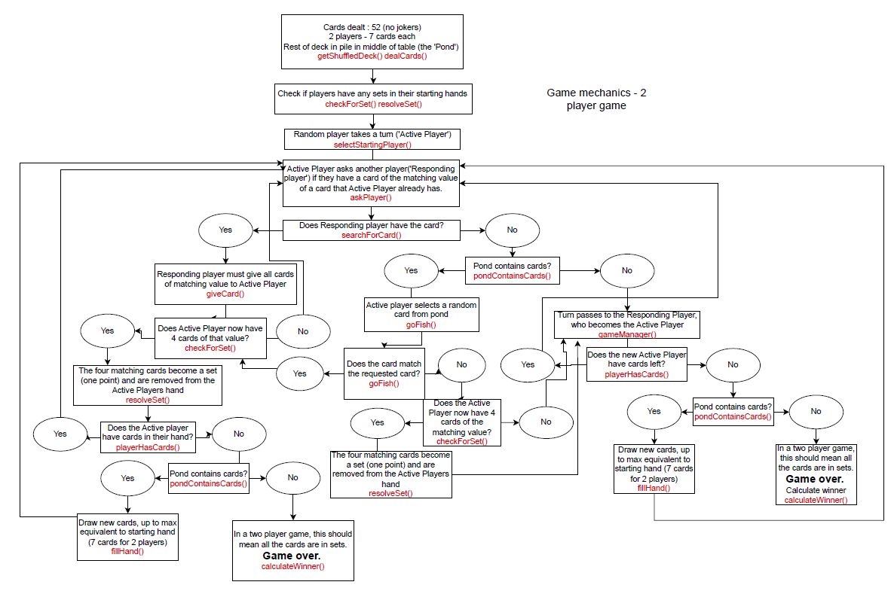
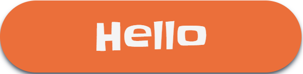

# Boilerplate: Fullstack with Sass
## Design Rules and Information

### 1. Grid Logic and Breakpoints
The system transitions through three distinct "modes" to ensure content remains readable across all device types. 
| Screen Type | Breakpoint | Columns | Gutter | Margin | Tailwind
| :--- | :--- | :--- | :--- | :--- | :---
| **Mobile** | < 768px | 4 | 16px | 16px | sm
| **Tablet** | 768px - 1023px | 8 | 20px | 32px | md
| **Desktop** | 1024px+ | 12 | 24px | 40px (at 1440px) | lg

### 2. Sizing Logic
We will try to stick to the standard measurements of **8px Grid System**. This will help with:

* **Scalability**: Most screen resolutions (1080p, 4K etc.) are divisible by 8
* **Easy Maths**: It divides cleanly into 4 and 2, which is essential for centering items or creating smaller sub-elements without ending up with "blurry" half-pixels (like 7.5px).
* **Consistency**: It removes the guesswork. You don't have to wonder, "Should this gap be 15px or 20px?" You just pick 16px.

#### How to Apply It
When using this system, every dimension—padding, margins, heights, and widths—should be a multiple of 8 ($8, 16, 24, 32, 40, 48 \dots$).

**The Hard Grid vs. Soft Grid**
* Hard Grid: You place every element into a literal grid of 8x8 pixel squares. This is more common in icon design.

* Soft Grid: You focus on the space between elements. This is the standard for web layouts. You just ensure that margins and padding follow the 8px rule.

**Typography & the 4px Exception**
While 8px is great for layout, it can be too "chunky" for text. We will use a **4px baseline** for typography.
* **Line-Height**: If your text is 16px, you might set the line height to 24px (a multiple of 8) or 20px (a multiple of 4). This ensures the "box" the text sits in still fits into the overall grid.

**Using Relative Units (rem)**
In modern CSS, we don't usually hard-code 8px. Instead, we use rem units based on a default font size (usually 16px).
* $1 \text{rem} = 16\text{px}$ (2 units of 8)
* $0.5 \text{rem} = 8\text{px}$ (1 unit of 8)
* $1.5 \text{rem} = 24\text{px}$ (3 units of 8)

**Pro Tip:** If 8px feels too restrictive for tight spaces (like inside a small button), many systems allow for a 4px "half-step" to give you a bit more flexibility while staying within the family.

### 3. Component Structure and Styling
Refer to [Figma for visualisation](https://www.figma.com/design/2a5BQYrW8WsMy4aMdb0SxJ/Go-Fish-Designs?node-id=0-1&t=RxczT0mIEsevZFhv-1) 

#### Color Theme:
```css
/* Note these names can be changed */
lightBlue: #93C8E9
fishOrange: #EB6F3A
darkBlue: #0C0878
whiteText: #F4F4F4
```

#### UI/Themed Component standardisaton
Compoents like buttons, popups(modals) can be standardise in a UI/Themed component. These should exist in a folder under client/component/themedUI.
Components can be created like below:

``` typescript

interface Props{
  children: ReactNode
  classname?: string
  otherProps: Type
}

export default function MyComponent({children, classname=""}:Props){
  // Some code and logic if needed
  return(
    //  using Tailwind the themed styling is consistent and then more custom styling can be enetered via the classname Prop//
    <div classname={`Themed UI styling like background color, hover color, text etc ${classname}`}>

    
    {children} // -> whatever is in the component

    </div>
  )
}
```

This is how it would be called:
```typescript
<MyComponent classname="extra custom styling" otherProps={myprops}>

//children
<p>Hello I am your son</p>
</MyComponent>
```


## Planning

### Game mechanics (2 player game)



#### Functions / variables

1. const maxCards = decided by number of players.
   - 2 players, 7 cards
   - 3 players, 6 cards
   - 4 players, 5 cards

1. getShuffledDeck() => deck  
   Sends a GET request via proxy server to [Deck Of Cards API](https://deckofcardsapi.com/) draw a card option,
   drawing 52 cards from a new shuffled deck. Returns the shuffled deck of cards.

1. selectStartingPlayer(player[]) => player  
   Return randomised starting player

1. dealCards(numOfPlayers, deck) => players, deck
   Takes a deck of cards and the number of players and returns an array of player objects and the remaining deck. Each player object will have a hand of cards, starting at the amount of maxCards. The remaining deck becomes the pond of cards.

1. pondContainsCards(deck) => boolean  
   Checks if the pond/deck still contains cards by checking length of card array and returns true/false

1. goFish(player, deck, requestedCardValue) => player, deck, boolean  
   Requires pond to have cards. Removes one card from the deck and adds it to the players hand. Checks if card matches the requested cardValue. Returns the updated player/deck and boolean for whether the card matched the card originally requested of the player.

1. fillHand(player, deck) => player, deck
   Requires pond to have cards. Fills the hand of the player up to the maxCard amount (less if there are less left in the pile).

1. checkForSet(player) => boolean
   Checks for sets of four cards of the same value in the player's hand.

1. resolveSet(player) => player  
   Removes sets and adds 1 to player's set count.

1. askPlayer(player) => card value
   Active Player is prompted to ask another player for a card of the same value as one of the cards the Active Player has in its hand. Perhaps they tap one of the cards in their hand to do this, or could have buttons that pop up with the values they can ask for. Returns the selected card value

1. searchForCard(player, cardValue) => number  
   Checks if a player has any cards of a particular value. Returns the number of matching cards (0 if none found)

1. giveCard(player) => card[], player
   If the responding player has any matching cards in their hand, they must give all of these to the Active Player. The cards are removed from the player's hand.

1. calculateWinner(player[])=> player[]
   Check the value of the sets property on the player object, return array of player objects of player(s) that have won (could be more than one if it's a draw)

1. playerHasCards(player) => boolean  
   Return true if player has cards in their hand, false if none

1. gameManager() => void  
   Runs the game (prompts etc) and controls turns

# Themed UI Components
## ThemedButton Component
The ThemedButton is a highly interactive, animated button built with **React, Tailwind CSS**, and **Framer Motion**. It features a spring-based entry animation and tactile feedback on hover and tap.
### 🛠 Anatomy of the Component
The component is composed of three main layers:

1. **Motion Engine**: Uses motion.button to handle the entrance (scaling up) and interactive states (tapping/hovering).

2. **Spring Physics**: A custom transition object defines the "bounciness" of the button.

3.  **Dynamic Styling**: Uses template literals to toggle between **orange** and **darkBlue** themes based on props.

#### Transition Config
```Javascript
const transition = {
  type: 'spring',
  stiffness: 210,
  damping: 20,
  delay: 0.1,
}
```
### Props References
| Prop | Type | Default | Description
| :--- | :--- | :--- | :---|
| Children | ReactNode |required| The text or elements to display inside the button.
| color | 'orange' or 'darkBlue' | 'orange' | Switches the background color theme.
| onClick| MouseEventHandler | undefined | function to trigger on click
| classname| string| ''| Additional Tailwind classes for custom positioning or overrides.



## TitleWrapper
The TitleWrapper component is a high-order layout component designed to manage the visual state transition between the Intro/Title Screen and the Active Game State.

### 1. State Management
The component uses a single boolean state, started, to toggle the layout:
* ```started: false```: Displays a large, centered hero section with the "Go Fish" logo and a "Play Now" button.
* ```started: true```: Shrinks and relocates the logo to the top-left corner (navigation style) and mounts the game content.

### 2. Animation Strategy
We leverage Framer Motion for a seamless transition without needing complex CSS keyframes:

* Shared Layout (layout prop): Framer Motion detects the change in the logo's position (from center-stack to top-left row) and automatically interpolates the movement.

* Conditional Mounting: The children (game area) are only rendered once started is true, using an initial fade-in and slide-up animation to avoid a jarring appearance.

* Responsive Scaling: The logo text and image sizes are controlled via Tailwind CSS utility classes, which transition smoothly over 500ms using transition-all.
## Setup

### Installation

git clone git@github.com:jennifer-legg/go-fish.git  
cd go-fish  
npm install # to install dependencies  
npm run dev # to start the dev server

You can find the server running on [http://localhost:3000](http://localhost:3000) and the client running on [http://localhost:5173](http://localhost:5173).
